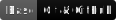

  <h1 class="profile__title">👋 Привет, я Денис!   </h1>
  

  
  

    Рад видеть тебя в моем профиле!
  

  

    Я веб-разработчик, мне интересна Frontend - разработка. Для меня важно, чтобы сайты не только выполняли свои функции, но и были внешне красивыми, вызывали восторг. Считаю, что внешняя составляющая сайта - это 70 % успеха.
  

  
- 🌱  В данный момент я изучаю более детально JavaScript. 
- 👯  Я работаю на фрилансе, получаю коммерческий опыт, чтобы в дальнейшем устроиться в IT - компанию. Моя цель - дойти до уровня Middle и стать профессиональным Frontend-разработчиком.
- 📫  Как можно со мной связаться: den_maverick177@mail.ru, Denis-mamlev@rambler.ru, [telegram](https://t.me/Denny_maverick), [vkontakte](https://vk.com/maverick177).  

<h2 class="profile__skills-title">
  МОИ НАВЫКИ В WEB-РАЗРАБОТКЕ: 
</h2>

  
***  

   Я знаю, когда каждый день ты идешь к своей мечте — ты непременно дойдешь до конца. Я уверен. Никогда не отступай и слушай свое сердце! 💖

  
  ### Мои трафеи в сервисе GitHub:
  
  
  
 
 
  

  <h1 class="profile__title">👋 Hi, I am Denny!   </h1>
  

  
  

    I am so glad to see you in my profile!
  

  

    I'm a web developer, I'm interested in Frontend development. It is important for me that websites not only perform their functions, but are also visually beautiful and arouse delight. I believe that the external component of a website is 70% of success.
  

  
- 🌱  I’m currently learning JavaScript. 
- 👯  I work as a freelancer, gaining commercial experience in order to later get a job in an IT company. My goal is to reach the Middle level and become a professional Frontend developer.
- 📫  How to reach me: den_maverick177@mail.ru, Denis-mamlev@rambler.ru, [telegram](https://t.me/Denny_maverick), [vkontakte](https://vk.com/maverick177). 

<h2 class="profile__skills-title">
  MY SKILLS IN WEB-DEVELOPING: 
</h2>

  
***  

   I know, when you every day going to your dream — you'll come to it. I am sure. Never back down and listen to you heart! 💖

  
  ### My trophies in GitHub Service:
  
  
  
 
 
  

